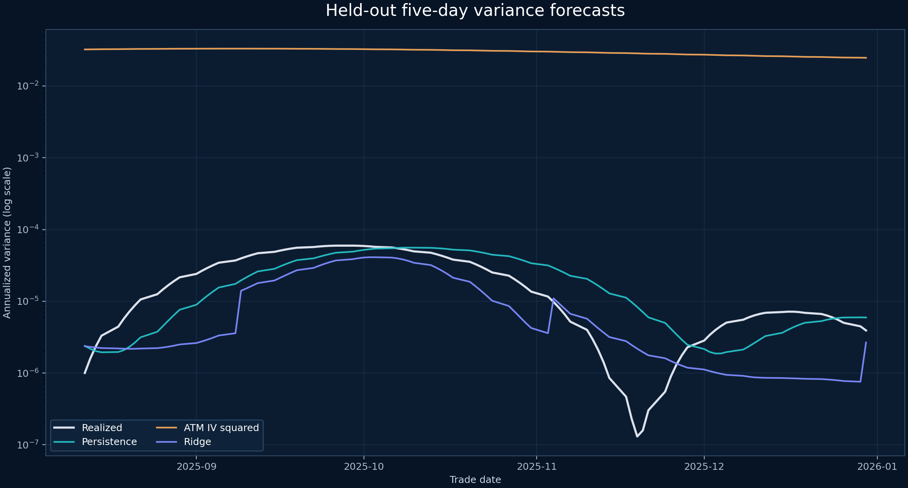
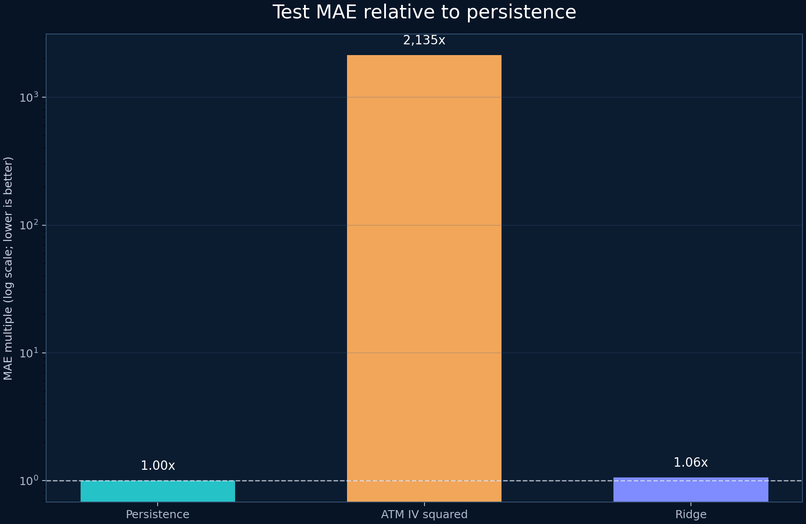

# Une surface d'options peut-elle prévoir la variance réalisée ?

Le dépôt s'appelle `options-arb-scanner`, mais son code actuel ne recherche pas d'arbitrage. Il résume une chaîne d'options SPY de fin de séance en six variables, puis cherche à prévoir la variance réalisée annualisée des cinq séances suivantes.

Ce sont deux sujets de recherche distincts. Un scanner de valeur relative confronte des prix d'options exécutables à des relations d'absence d'arbitrage ou à un modèle de valorisation, puis tient compte des coûts de transaction et de la couverture. Ici, le modèle produit une prévision statistique de variance. Il ne propose ni trade ni profit garanti.

La différence s'est révélée plus que rédactionnelle lors d'un second audit. La première version de la cible comportait un décalage d'un jour : la fenêtre glissante pouvait inclure le rendement se terminant à la date des variables. Le test unitaire, construit avec des rendements constants, ne pouvait pas repérer l'erreur puisque toutes les fenêtres avaient la même valeur. Un calcul manuel avec des rendements différents l'a mise en évidence. Le pipeline corrigé purge aussi les cibles qui se chevauchent aux frontières des échantillons et écarte les cotations individuellement invalides.


L'échantillon versionné contient 522 jours ouvrés du 2 janvier 2024 au 31 décembre 2025 et 20 880 cotations d'options synthétiques. Il s'agit de données de test déterministes. Les résultats ci-dessous testent le pipeline de recherche, pas le marché réel des options SPY.

## Définir la quantité avant de la prévoir

Notons $S_t$ le cours de clôture de SPY à la date de négociation $t$. Le rendement logarithmique de clôture à clôture qui se termine en $t$ est $r_t$ :

$$
r_t = \ln\left(\frac{S_t}{S_{t-1}}\right).
$$

Notons $h=5$ l'horizon de prévision en séances et $A=252$ le facteur d'annualisation en séances par an. La variance réalisée future non annualisée, connue après la date $t+h$, vaut

$$
RV_{t,t+h} = \sum_{i=1}^{h}r_{t+i}^{2}.
$$

Multiplier la moyenne quotidienne des rendements au carré par $A$ donne la cible annualisée :

$$
RV^{(A)}_{t,t+h}
= A\left(\frac{1}{h}\sum_{i=1}^{h}r_{t+i}^{2}\right)
= \frac{A}{h}RV_{t,t+h}.
$$

Chaque rendement de cette cible se termine après $t$. L'implémentation forme maintenant une somme glissante complète, puis la recule de $h$ lignes :

```python
forward_sum_squared_returns = frame.groupby("symbol")["squared_log_return"].transform(
    lambda series: (
        series.rolling(window=horizon_days, min_periods=horizon_days)
        .sum()
        .shift(-horizon_days)
    )
)
```

Prenons un calcul manuel sur deux jours. Supposons que les rendements se terminant aux dates 1 à 4 soient $0.01$, $0.02$, $0.03$ et $0.04$. La cible à la date 0 doit utiliser $0.01^2+0.02^2$. Celle de la date 1 doit utiliser $0.02^2+0.03^2$. Le nouveau test unitaire vérifie ces deux valeurs. Une suite constante ne peut pas déceler ce type d'erreur d'indexation.

Cette définition s'inscrit dans les travaux sur la variance réalisée, même si le projet emploie des rendements quotidiens plutôt qu'intrajournaliers. [Andersen, Bollerslev, Diebold et Labys (2003)](https://doi.org/10.1111/1468-0262.00418) fournissent les fondements empiriques de la modélisation et de la prévision de la volatilité réalisée.

## Transformer une chaîne irrégulière en six variables quotidiennes

Pour chaque option, notons $b$ le prix bid et $a$ le prix ask. Notons $\sigma^{bid}$ et $\sigma^{ask}$ les volatilités implicites obtenues à partir de ces deux prix. Le code définit les prix et volatilités médians par

$$
m = \frac{a+b}{2}, \qquad
\sigma^{mid} = \frac{\sigma^{ask}+\sigma^{bid}}{2}.
$$

Avant de construire un point de surface, le pipeline retire les marchés croisés ($a<b$), les prix médians ou strikes non positifs, les bornes de volatilité implicite non positives ou inversées, les types d'options inconnus et les volumes ou open interest négatifs. Lorsqu'un call et un put partagent le strike at-the-money (ATM) le plus proche, le code moyenne leurs volatilités implicites médianes. L'ordre des lignes ne peut donc pas modifier la variable.

L'échéance la plus proche de 30 jours calendaires fournit le point court. Celle qui se trouve au plus près de 60 jours fournit le point long. Notons $K$ le strike. La log-moneyness vaut $\ln(K/S_t)$, donc le strike ATM minimise $|\ln(K/S_t)|$. Si $\sigma_{30}$ et $\sigma_{60}$ sont les volatilités ATM médianes retenues, alors

$$
\text{term slope}_t = \sigma_{60}-\sigma_{30}.
$$

Pour le downside skew, notons $\sigma_{30}^{put,down}$ la volatilité implicite médiane du put dont le strike est le plus proche mais strictement inférieur au spot, et $\sigma_{30}^{put,ATM}$ celle du put ATM. On obtient

$$
\text{downside skew}_t
= \sigma_{30}^{put,down}-\sigma_{30}^{put,ATM}.
$$

Une valeur positive indique que le put sous le spot porte une volatilité implicite supérieure à celle du put ATM. Le vecteur complet contient la volatilité implicite ATM à 30 jours, la pente 60 moins 30 jours, le downside skew, le spread bid-ask relatif moyen $(a-b)/m$, l'open interest total et la variance réalisée annualisée des 20 jours précédents.

La sélection par strike et échéance les plus proches reste facile à inspecter, mais rudimentaire. Une étude de marché interpolerait la variance implicite totale $\sigma^2\tau$, où $\tau$ désigne le temps jusqu'à l'échéance en années, à des maturités fixes. Elle calculerait aussi le skew à delta fixe. La [méthodologie du VIX de Cboe](https://cdn.cboe.com/api/global/us_indices/governance/VIX_Methodology.pdf) présente une mesure de variance à maturité constante, sans modèle et construite sur plusieurs strikes d'options SPX. Ce projet utilise des options SPY, et élever une seule volatilité ATM au carré n'est pas le calcul du VIX.

## Valider une cotation ne suffit pas à prouver l'absence d'arbitrage

Les nouveaux filtres vérifient qu'un enregistrement isolé est exploitable. Ils ne garantissent pas l'absence d'arbitrage statique sur la surface.

Pour des calls européens de même échéance, notons $C(K)$ le prix du call en fonction du strike $K$. Si $K_1<K_2$, l'absence d'arbitrage par spread vertical impose

$$
C(K_1) \geq C(K_2).
$$

Pour trois strikes équidistants $K_1<K_2<K_3$, l'absence d'arbitrage par butterfly impose la convexité :

$$
C(K_1)-2C(K_2)+C(K_3) \geq 0.
$$

Notons $P(K)$ le prix du put correspondant, $r$ le taux sans risque en capitalisation continue, $q$ le rendement continu du dividende et $\tau$ le temps jusqu'à l'échéance en années. La parité put-call européenne impose

$$
C(K)-P(K)=S_t e^{-q\tau}-K e^{-r\tau}.
$$

Le pipeline ne vérifie aucune de ces relations entre cotations. Les équations ci-dessus concernent des options européennes, alors que les options SPY cotées permettent un exercice anticipé de style américain. Un scanner réel devrait donc employer les bornes adaptées à ce droit d'exercice. Le projet ne renseigne pas le style d'exercice. Il ne dispose pas non plus des tailles exécutables, frais, glissement de couverture, contraintes d'emprunt ni d'horodatages synchronisés. [Davis et Hobson (2007)](https://doi.org/10.1111/j.1467-9965.2007.00291.x) étudient les bornes des prix d'options et la logique d'arbitrage qui les sous-tend. Qualifier ce code de scanner d'arbitrage exagérerait sa portée.

## Benchmarks, ridge et chronologie purgée

Le benchmark de persistance prévoit la variance annualisée sur cinq jours avec la variance annualisée des 20 jours passés. Le benchmark d'options élève au carré la volatilité implicite ATM à 30 jours :

$$
f_t^{IV}=\sigma_{30,t}^{2}.
$$

$f_t^{IV}$ et $RV^{(A)}_{t,t+5}$ sont tous deux des variances annualisées. Aucun facteur supplémentaire de $5/252$ n'est requis. Des unités identiques masquent toutefois une hypothèse économique forte : la variance implicite risque-neutre à 30 jours doit approximer l'espérance physique de variance à cinq jours. L'écart de maturité et la prime de risque de variance peuvent rompre ce lien, même avec des données parfaites.

Le modèle principal est une régression ridge. Notons $x_t$ les six variables standardisées, $y_t=\ln(RV^{(A)}_{t,t+5})$, $b$ l'ordonnée à l'origine, $\beta$ les six coefficients, $n$ le nombre d'observations d'entraînement et $\alpha=1$ le poids de la pénalité. Les paramètres ajustés minimisent

$$
\sum_{t=1}^{n}\left(y_t-b-x_t^{\mathsf{T}}\beta\right)^2
+\alpha\sum_{j=1}^{6}\beta_j^2.
$$

La régression ridge a été introduite par [Hoerl et Kennard (1970)](https://doi.org/10.1080/00401706.1970.10488634). La standardisation est estimée sur les seules lignes d'entraînement. L'exponentielle d'une prévision logarithmique produit une variance positive mais, sans correction de retransformation, elle estime sous des hypothèses usuelles une médiane conditionnelle plutôt qu'une moyenne conditionnelle. Ce choix correspond plus naturellement à l'erreur absolue moyenne (MAE) qu'à la racine de l'erreur quadratique moyenne (RMSE). L'expérience publie les deux, donc ce décalage entre objectif et métrique demeure une limite.

La séparation est chronologique : 60 % pour l'entraînement, 20 % pour la validation et 20 % pour le test avant purge. Deux cibles voisines sur cinq jours partagent quatre rendements futurs. Les cinq dernières lignes avant la validation et le test portent donc l'étiquette `purged` et sont exclues de l'ajustement comme de toutes les métriques.

| Segment | Lignes | Première date | Dernière date |
| --- | ---: | --- | --- |
| Entraînement | 293 | 2024-01-30 | 2025-03-13 |
| Purge avant validation | 5 | 2025-03-14 | 2025-03-20 |
| Validation | 94 | 2025-03-21 | 2025-07-30 |
| Purge avant test | 5 | 2025-07-31 | 2025-08-06 |
| Test | 100 | 2025-08-07 | 2025-12-24 |

Les mesures sont la RMSE, la MAE et QLIKE. Notons $v_t>0$ la variance réalisée, $f_t>0$ la variance prévue et $N$ le nombre de lignes évaluées. QLIKE vaut

$$
QLIKE = \frac{1}{N}\sum_{t=1}^{N}
\left[\ln(f_t)+\frac{v_t}{f_t}\right].
$$

Pour les trois mesures, une valeur plus basse est préférable. QLIKE peut être négative lorsque la variance est exprimée en décimales. [Patton (2011)](https://doi.org/10.1016/j.jeconom.2010.03.034) explique pourquoi le choix de la fonction de perte compte lorsque la volatilité elle-même est mesurée avec erreur.

## La persistance gagne toujours le test corrigé

Après correction de la cible, purge de dix lignes aux frontières et construction déterministe de la variable ATM, la persistance obtient les plus faibles RMSE, MAE et QLIKE hors échantillon. La MAE de ridge est supérieure de 5,8 %. Celle de la volatilité implicite ATM au carré atteint environ 2 135 fois la MAE de la persistance.

| Modèle | RMSE test | MAE test | QLIKE test | MAE / persistance |
| --- | ---: | ---: | ---: | ---: |
| Persistance | 1.76e-05 | 1.43e-05 | -9.582540 | 1.00x |
| VI ATM au carré | 3.06e-02 | 3.05e-02 | -3.492651 | 2,135.39x |
| Ridge | 1.99e-05 | 1.51e-05 | -7.447701 | 1.06x |



L'axe vertical logarithmique est nécessaire. La volatilité quotidienne des rendements du sous-jacent synthétique vaut 0,024 %, tandis que la volatilité implicite ATM reste proche de niveaux plausibles sur un marché ordinaire. Son carré produit une variance annualisée proche de $0.03$. La variance réalisée de l'échantillon de test va de $1.31\times10^{-7}$ à $5.96\times10^{-5}$. Le générateur n'a pas calibré ensemble les processus des options et du sous-jacent.



Le second graphique livre deux informations. Le benchmark de volatilité implicite a les bonnes unités mais une calibration économique incohérente. Ridge reste proche de la persistance en MAE, sans la battre, et se comporte beaucoup moins bien selon QLIKE. Rien dans ces résultats ne permet d'affirmer que les variables d'options améliorent la prévision de variance de SPY.

## Ce que l'expérience établit, et ce qu'elle n'établit pas

La nouvelle exécution, les 18 tests unitaires et l'exécution non interactive du notebook confirment que le chargeur hors ligne, la cible corrigée, les filtres de cotations, la séparation purgée, le modèle, les métriques et les graphiques fonctionnent ensemble. Les fichiers CSV figés dans `blog/data/` reproduisent chaque valeur de test tracée.

Ils ne démontrent aucune prévisibilité de marché. Une étude en données réelles doit encore utiliser un calendrier de séances, des prix ajustés du sous-jacent, une heure précise de snapshot des options antérieure ou égale à celle des variables, des règles contre les cotations périmées, une interpolation à maturité fixe, un skew à delta fixe, les taux et dividendes ainsi que des diagnostics complets d'arbitrage statique. Les choix de modèle et de pénalité doivent se faire sur la validation, puis le test ne doit être ouvert qu'une fois. Des réestimations glissantes permettraient d'observer l'instabilité des coefficients.

La comparaison des prévisions demande aussi une mesure d'incertitude adaptée au chevauchement des horizons. Un test de Diebold-Mariano, proposé par [Diebold et Mariano (1995)](https://doi.org/10.1080/07350015.1995.10524599), nécessiterait ici une estimation de variance de long terme qui tienne compte de ce chevauchement. La valeur économique exigerait un trade de variance précisément défini et tous ses coûts d'exécution.

La conclusion corrigée est étroite, mais utile : ce dépôt fournit maintenant une ossature plus propre pour prévoir la variance. Sur ces données synthétiques, la persistance gagne. Le projet ne dit encore rien sur un arbitrage ni sur un avantage exploitable.

## Références

- Andersen, T. G., Bollerslev, T., Diebold, F. X. et Labys, P. (2003), [« Modeling and Forecasting Realized Volatility »](https://doi.org/10.1111/1468-0262.00418), *Econometrica* 71(2), 579–625.
- Cboe Global Indices, [*VIX Index Methodology*](https://cdn.cboe.com/api/global/us_indices/governance/VIX_Methodology.pdf).
- Davis, M. H. A. et Hobson, D. G. (2007), [« The Range of Traded Option Prices »](https://doi.org/10.1111/j.1467-9965.2007.00291.x), *Mathematical Finance* 17(1), 1–14.
- Diebold, F. X. et Mariano, R. S. (1995), [« Comparing Predictive Accuracy »](https://doi.org/10.1080/07350015.1995.10524599), *Journal of Business & Economic Statistics* 13(3), 253–263.
- Hoerl, A. E. et Kennard, R. W. (1970), [« Ridge Regression: Biased Estimation for Nonorthogonal Problems »](https://doi.org/10.1080/00401706.1970.10488634), *Technometrics* 12(1), 55–67.
- Patton, A. J. (2011), [« Volatility Forecast Comparison Using Imperfect Volatility Proxies »](https://doi.org/10.1016/j.jeconom.2010.03.034), *Journal of Econometrics* 160(1), 246–256.
